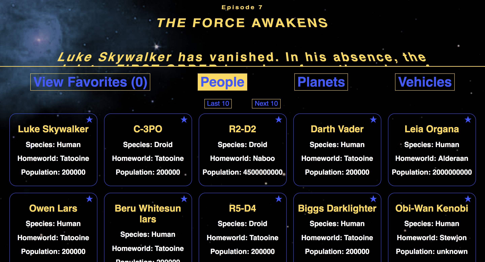

# SWAPIBox - Alex Bonder - (FE Mod 3)

## Synopsis

SWAPIBox is an interactive Star Wars database. It allows users to see characters, planets, and vehicles featured in the movies and save a list of their favorites.  

## Project Goals

* Separate application logic into small, testable functions.
* Create modular, reusable React components.
* Work with nested API calls. 
* Use propTypes to validate props passed to each component.
* Write meaningful, comprehensive unit and integration tests.

## Installation

This application was built using the `create-react-app` boilerplate. This boilerplate provides a lot of built in content and dependencies for free. The [documentation](https://github.com/facebookincubator/create-react-app) is avialable to read through.

To set up: 

Fork or clone this project

Run `npm install` from the root directory

Run `npm start` and visit localhost:3000 in your browser

You can begin running your tests with `npm test`

## Tests

The testing Enzyme documentation is helpful for this project:
[create-react-app
setupTests.js](https://github.com/facebookincubator/create-react-app/blob/master/packages/react-scripts/template/README.md#initializing-test-environment)  
[initializing the enzyme adapter](http://airbnb.io/enzyme/docs/installation/react-15.html)

The tests are a compilation of unit and integration tests to simulate the methods and events happening in the application.

## Screenshots

